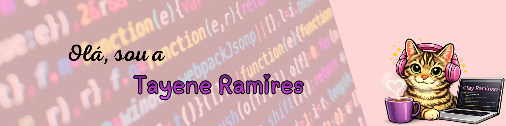

<!-- TÍTULO (PERFEITO E CENTRALIZADO) -->

<h1>   ˚· Tayene Ramires ·˚ <h1> 

<!-- GIF NO CANTO DIREITO (SEM AFETAR O TÍTULO) -->

Processo, critério e responsabilidade guiam meu trabalho!

Atualmente estou:
-  Estudando **Sistemas de Informação** na Faculdade Impacta  
-  Participando do **Bootcamp Full-Stack JavaScript** da Generation Brasil  
-  Aprofundando meus estudos em JavaScript, TypeScript, Node.js, Nest.js, HTML, CSS, POO e Lógica de Programação  
-  Em transição do setor financeiro para tecnologia, trazendo comigo organização, visão de processos, disciplina e foco  

---
  ## Contato

## 🛠️ Tecnologias e Ferramentas

